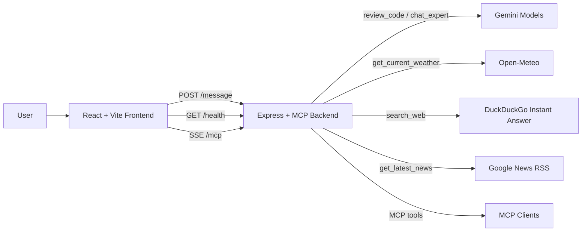
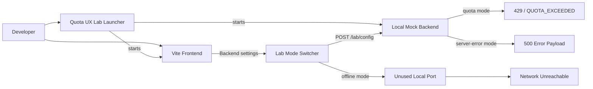

# Copilot-Bot

Copilot-Bot is a TypeScript-based MCP-enabled chat and review application for embedded software workflows. It combines a Node.js backend, a React/Vite frontend, Gemini-powered review and chat flows, external utility tools, and a local lab for reproducing quota and backend failure UX.

Copilot-Bot 是一個以 TypeScript 為基礎、支援 MCP 的嵌入式軟體對話與程式碼審查應用。它整合了 Node.js 後端、React/Vite 前端、Gemini 驅動的聊天與審查流程、外部工具整合，以及用來重現配額與後端錯誤 UX 的本機實驗環境。

## Quick Start / 快速開始

### 1. Install / 安裝

```powershell
npm install
```

### 2. Pick a Common Flow / 選擇常用啟動流程

#### UI Development with Stub Data / 使用 Stub 資料做前端開發

Use this when you want to work on the frontend without calling Gemini or external live tools.

當你只想開發前端、不想呼叫 Gemini 或即時外部工具時，使用這個流程。

Terminal 1 / 終端機 1:

```powershell
$env:MCP_REVIEW_MODE='stub'; $env:MCP_TRANSPORT='sse'; $env:MCP_WEB_HOST='127.0.0.1'; $env:MCP_WEB_PORT='3000'; node dist-server/server.js
```

Terminal 2 / 終端機 2:

```powershell
npm run web:dev
```

Then open / 接著開啟：

```text
http://127.0.0.1:5173
```

#### Live Chat and Review / 啟用即時聊天與程式碼審查

Use this when you have a valid `GEMINI_API_KEY` and want real review/chat behavior.

當你已設定有效的 `GEMINI_API_KEY`，並希望使用真正的聊天與審查能力時，使用這個流程。

Terminal 1 / 終端機 1:

```powershell
npm run build:server
$env:GEMINI_API_KEY='your-key-here'
$env:MCP_REVIEW_MODE='live'; $env:MCP_TRANSPORT='sse'; $env:MCP_WEB_HOST='127.0.0.1'; $env:MCP_WEB_PORT='3000'; node dist-server/server.js
```

Terminal 2 / 終端機 2:

```powershell
npm run web:dev
```

Then open / 接著開啟：

```text
http://127.0.0.1:5173
```

#### Failure / Quota UX Testing / 測試配額與錯誤處理 UX

Use this when you want to test `429`, `500`, or unreachable-backend handling without consuming Gemini quota.

當你想測試 `429`、`500` 或後端不可達情境，而且不想消耗 Gemini 配額時，使用這個流程。

```powershell
npm run dev:quota
```

Then in the frontend / 接著在前端中：

- click `Backend` / 點擊 `Backend`
- use `Lab Mode` / 使用 `Lab Mode`
- choose `Quota 429`, `Backend 500`, or `Offline / Unreachable` / 選擇 `Quota 429`、`Backend 500` 或 `Offline / Unreachable`
- click `Apply Lab Mode` / 點擊 `Apply Lab Mode`

### 3. Sanity Check / 快速檢查

If you want a quick validation pass after setup:

如果你想在完成環境設定後做一次快速驗證：

```powershell
npx tsc --noEmit
npm run web:build
npm run smoke:quota-lab
```

### 4. What to Try in the UI / UI 中可以直接測試什麼

- Ask a general question about ISR/main-loop race conditions. / 詢問 ISR 與 main loop race condition 的一般問題。
- Paste C/C++ code to trigger `review_code` mode. / 貼上 C/C++ 程式碼來觸發 `review_code` 模式。
- Click the capability chips in the backend metadata panel. / 點擊 backend metadata 面板中的 capability chips。
- Switch between `STUB` and `LIVE` in the header. / 在 header 中切換 `STUB` 與 `LIVE`。
- Open `Backend` settings and change `Lab Mode`. / 開啟 `Backend` 設定並切換 `Lab Mode`。

## What It Does / 功能概覽

- Chat with an embedded-software assistant in a conversational UI. / 以對話式 UI 與嵌入式軟體助手互動。
- Review C/C++ code for thread-safety and embedded-system risks. / 針對 C/C++ 程式碼進行 thread-safety 與嵌入式風險審查。
- Route prompts to tool calls for weather, web search, and latest news. / 將提示路由到天氣、網頁搜尋與最新新聞工具。
- Expose the same capabilities through an MCP server over stdio or SSE. / 透過 stdio 或 SSE 的 MCP server 暴露相同能力。
- Surface backend/runtime health, model metadata, and capability status in the frontend. / 在前端顯示後端健康狀態、模型資訊與能力狀態。
- Reproduce `429`, `500`, and unreachable-backend UI states locally without burning Gemini quota. / 在本機重現 `429`、`500` 與後端不可達的 UI 狀態，而不消耗 Gemini 配額。

## Runtime Flow / 執行流程



Runtime summary / 執行摘要：

- The frontend uses `/message`, `/health`, and optional SSE `/mcp` to talk to the backend. / 前端透過 `/message`、`/health` 與可選的 SSE `/mcp` 與後端通訊。
- The backend routes requests to Gemini or the live utility integrations depending on inferred or explicit mode. / 後端會根據推斷或明確指定的模式，把請求路由到 Gemini 或即時工具整合。
- MCP clients can consume the same tool surface through the MCP server. / MCP client 可以透過 MCP server 使用同一組工具能力。

## Development Flow / 開發流程



Development summary / 開發摘要：

- The local lab can launch the frontend and mock backend together. / 本機 lab 可以同時啟動前端與 mock backend。
- The in-app `Lab Mode` switcher can change the running mock backend between `quota` and `server-error` without restarting it. / 頁面內的 `Lab Mode` 切換器可以在不重啟 mock backend 的情況下切換 `quota` 與 `server-error`。
- `Offline / Unreachable` points the frontend at an unused local port to simulate connection failure. / `Offline / Unreachable` 會把前端指向未使用的本機 port 來模擬連線失敗。

## Current Feature Set / 目前功能

### Frontend UX / 前端體驗

- React + Vite chat interface with a local-first conversation history. / 以 React + Vite 建構的聊天介面，並採用 local-first 對話歷史紀錄。
- STUB / LIVE mode switching from the header. / 可在 header 中切換 STUB / LIVE 模式。
- Configurable backend origin from the UI. / 可直接在 UI 中設定 backend origin。
- Backend metadata panel showing build, version, mode, transport, and capability set. / backend metadata 面板顯示 build、version、mode、transport 與 capabilities。
- Capability chips that can directly trigger example prompts. / capability chips 可直接送出範例 prompt。
- Quick actions for weather, news, and search. / 提供天氣、新聞與搜尋的 quick actions。
- Structured rendering of code review output, including summary, risks, and advice. / 以結構化方式顯示 code review 結果，包含 summary、risks 與 advice。
- Local persistence: chat history. / 本機持久化：聊天紀錄。
- Local persistence: selected mode. / 本機持久化：所選模式。
- Local persistence: backend origin. / 本機持久化：backend origin。
- Local persistence: backend panel collapsed state. / 本機持久化：backend 面板收合狀態。
- Local persistence: lab mode selection. / 本機持久化：lab mode 選擇。

### Toast and Error UX / Toast 與錯誤處理 UX

- Bottom-right floating toast notifications. / 右下角浮動 toast 通知。
- Manual dismiss support. / 支援手動關閉。
- Auto-dismiss countdown bar. / 提供自動消失倒數進度條。
- Alert cooldown logic to avoid repeated flashing for the same warning. / 透過 alert cooldown 避免同一警示反覆閃爍。
- Tone-based styling for warning and error toasts. / 依 warning 與 error 套用不同視覺樣式。
- Error classification: `QUOTA_EXCEEDED`. / 錯誤分類：`QUOTA_EXCEEDED`。
- Error classification: generic `HTTP 429`. / 錯誤分類：一般 `HTTP 429`。
- Error classification: `HTTP 5xx`. / 錯誤分類：`HTTP 5xx`。
- Error classification: unreachable backend / network failure. / 錯誤分類：後端不可達或網路失敗。
- Error classification: generic request/runtime failures. / 錯誤分類：一般 request/runtime 錯誤。

### Backend Features / 後端功能

- Express-based web server. / 以 Express 為基礎的 web server。
- MCP server support: stdio. / MCP server 支援：stdio。
- MCP server support: SSE. / MCP server 支援：SSE。
- Web endpoint: `/health`. / Web endpoint：`/health`。
- Web endpoint: `/api/review`. / Web endpoint：`/api/review`。
- Web endpoint: `/message`. / Web endpoint：`/message`。
- Web endpoint: `/mcp`. / Web endpoint：`/mcp`。
- Prompt route: `review_code`. / Prompt 路由：`review_code`。
- Prompt route: `chat_expert`. / Prompt 路由：`chat_expert`。
- Prompt route: `get_current_weather`. / Prompt 路由：`get_current_weather`。
- Prompt route: `search_web`. / Prompt 路由：`search_web`。
- Prompt route: `get_latest_news`. / Prompt 路由：`get_latest_news`。
- Stub mode for local/demo behavior. / Stub mode 用於本機開發或展示。
- Live mode for Gemini-backed review/chat plus external utility tools. / Live mode 提供 Gemini 驅動的聊天與審查，以及外部工具整合。
- Health payload includes runtime metadata used by the frontend. / Health payload 包含前端需要的 runtime metadata。

### AI and Tooling / AI 與工具整合

- Gemini model fallback across configured candidates. / Gemini 模型可在候選列表間 fallback。
- Retry and backoff handling for transient provider failures. / 對暫時性供應商失敗提供 retry 與 backoff 處理。
- Quota-aware mapping for Gemini `429` conditions. / 對 Gemini `429` 提供配額感知的錯誤映射。
- Open-Meteo integration for weather. / 使用 Open-Meteo 提供天氣查詢。
- DuckDuckGo Instant Answer integration for search. / 使用 DuckDuckGo Instant Answer 提供搜尋整合。
- Google News RSS integration for news. / 使用 Google News RSS 提供新聞整合。

### Local Lab / Failure Simulation / 本機 Lab 與失敗情境模擬

- Local mock backend for quota and server-error scenarios. / 提供本機 mock backend 來模擬 quota 與 server-error 情境。
- Frontend-only offline scenario that points to an unreachable backend target. / 提供只啟前端、但指向不可達後端的 offline 情境。
- Runtime scenario switching from the frontend header via `Lab Mode`. / 可在前端 header 透過 `Lab Mode` 即時切換情境。
- Mock backend runtime reconfiguration through `/lab/config`. / 可透過 `/lab/config` 在執行中重新設定 mock backend。
- Dedicated smoke test to verify mode switching changes `/message` status codes. / 提供專用 smoke test 驗證切換情境後 `/message` 狀態碼是否改變。

### Deployment Assets / 部署資產

- Dockerfile for backend deployment. / 後端部署用 Dockerfile。
- `.dockerignore`. / `.dockerignore`。
- `render.yaml` for split Render deployment. / 用於 Render 分離部署的 `render.yaml`。
- `RENDER.md` with Render-specific deployment guidance. / 包含 Render 部署說明的 `RENDER.md`。

## Stack / 技術棧

- Frontend: React 19, Vite 7, TypeScript, Tailwind CSS / 前端：React 19、Vite 7、TypeScript、Tailwind CSS
- Backend: Node.js, Express 5, TypeScript / 後端：Node.js、Express 5、TypeScript
- AI: `@google/generative-ai` / AI：`@google/generative-ai`
- Protocol: `@modelcontextprotocol/sdk` / 協定：`@modelcontextprotocol/sdk`
- Dev runtime: `ts-node` / 開發執行環境：`ts-node`

## Project Structure / 專案結構

```text
src/
    server.ts                Main backend + MCP/SSE/web API server
    mcp-smoke-test.ts        Existing MCP smoke test
    quota-mock-server.ts     Local mock backend for quota/server-error scenarios
    quota-lab.ts             One-click local lab launcher
    quota-lab-smoke-test.ts  Automated smoke test for lab mode switching
    web/
        main.tsx             Frontend entrypoint
        ReviewChat.tsx       Main chat screen and toast handling
        components/
            ReviewHeader.tsx Header, backend settings, runtime metadata, lab controls
        hooks/
            useMCP.ts        Frontend transport, prompt submission, alert classification
        styles.css           App styling and toast system
```

## Requirements / 環境需求

- Node.js 18+ / 需要 Node.js 18 以上
- npm / 需要 npm
- Optional: `GEMINI_API_KEY` for live Gemini chat/review / 若要使用即時 Gemini 聊天與審查，需提供 `GEMINI_API_KEY`

## Environment Variables / 環境變數

### Backend Runtime / 後端執行環境

- `MCP_REVIEW_MODE`: `stub` or `live` / 設定審查模式為 `stub` 或 `live`
- `MCP_TRANSPORT`: `stdio` or `sse` / 設定傳輸方式為 `stdio` 或 `sse`
- `MCP_WEB_HOST`: web server bind host / web server 綁定的 host
- `MCP_WEB_PORT`: web server port / web server port
- `PORT`: alternate web server port override / 備援的 web server port 覆蓋值
- `MCP_WEB_CORS_ORIGIN`: comma-separated allowed origins / 逗號分隔的允許來源清單
- `GEMINI_API_KEY`: Gemini API key for live chat/review / 即時聊天與審查所需的 Gemini API key
- `GEMINI_MODEL`: single Gemini model override / 指定單一 Gemini model
- `GEMINI_MODEL_CANDIDATES`: comma-separated Gemini fallback list / 逗號分隔的 Gemini fallback 候選列表

### Local Lab / 本機 Lab

- `QUOTA_LAB_MODE`: `quota`, `server-error`, or `offline` / 指定 lab 模式
- `QUOTA_MOCK_MODE`: `quota` or `server-error` / 指定 mock backend 模式
- `QUOTA_MOCK_HOST` / mock backend host
- `QUOTA_MOCK_PORT` / mock backend port
- `QUOTA_LAB_WEB_HOST` / lab frontend host
- `QUOTA_LAB_WEB_PORT` / lab frontend port
- `QUOTA_LAB_OFFLINE_PORT` / offline mode 使用的不可達 port
- `QUOTA_SMOKE_PORT` / smoke test 使用的 port

## Install / 安裝

```powershell
npm install
```

## Run / 執行

### Build and Validate / 建置與驗證

Use this when you want to confirm the workspace compiles cleanly.

當你想確認整個 workspace 可以正常編譯時，使用這組指令。

```powershell
npx tsc --noEmit
npm run build:server
npm run web:build
```

### Frontend Development with Stub Backend / 使用 Stub Backend 進行前端開發

Use this when you want predictable local behavior without Gemini or live external dependencies.

當你希望在沒有 Gemini 與即時外部依賴的情況下，用穩定可預期的資料進行前端開發時，使用這個流程。

Backend terminal / 後端終端機：

```powershell
$env:MCP_REVIEW_MODE='stub'; $env:MCP_TRANSPORT='sse'; $env:MCP_WEB_HOST='127.0.0.1'; $env:MCP_WEB_PORT='3000'; node dist-server/server.js
```

Frontend terminal / 前端終端機：

```powershell
npm run web:dev
```

### Live Backend for Real Chat and Review / 啟動 Live Backend 以進行真實聊天與審查

Use this when you want real Gemini-backed review/chat and live external tool behavior.

當你想使用真正的 Gemini 審查與聊天，以及即時外部工具行為時，使用這個流程。

```powershell
npm run build:server
$env:GEMINI_API_KEY='your-key-here'
$env:MCP_REVIEW_MODE='live'; $env:MCP_TRANSPORT='sse'; $env:MCP_WEB_HOST='127.0.0.1'; $env:MCP_WEB_PORT='3000'; node dist-server/server.js
```

### Local Quota and Failure Lab / 本機配額與錯誤 Lab

Use this when you want to test `429`, `500`, and unreachable-backend handling without spending live quota.

當你想測試 `429`、`500` 與後端不可達處理，而且不想消耗 live quota 時，使用這個流程。

```powershell
npm run dev:quota
```

Alternative lab entrypoints / 其他 lab 入口：

- `npm run dev:quota:429`: explicit quota scenario / 明確的 quota 情境
- `npm run dev:quota:500`: mock backend `500` scenario / mock backend `500` 情境
- `npm run dev:quota:offline`: unreachable backend scenario / 後端不可達情境

## NPM Scripts / NPM 指令

### Development / 開發

- `npm run dev`: nodemon backend development entrypoint / 使用 nodemon 啟動後端開發入口
- `npm run dev:live`: ts-node live backend shortcut / 使用 ts-node 啟動 live backend 的捷徑
- `npm run start`: run compiled backend / 啟動編譯後的後端
- `npm run web:dev`: Vite dev server / 啟動 Vite 開發伺服器

### Build / 建置

- `npm run build:server`: backend compile / 編譯後端
- `npm run build`: frontend build / 建置前端
- `npm run build:all`: backend + frontend build / 同時建置前後端
- `npm run web:build`: production frontend build / 建置正式版前端
- `npm run web:preview`: preview built frontend / 預覽建置後的前端

### Test / 測試

- `npm run smoke:mcp`: existing MCP smoke test / 現有的 MCP smoke test
- `npm run smoke:quota-lab`: automated smoke test for local lab mode switching / 自動化驗證 lab mode 切換的 smoke test

### Lab / 實驗模式

- `npm run dev:quota`: starts the default quota lab / 啟動預設 quota lab
- `npm run dev:quota:429`: starts the explicit `429 / QUOTA_EXCEEDED` lab / 啟動明確的 `429 / QUOTA_EXCEEDED` lab
- `npm run dev:quota:500`: starts the `500` backend-failure lab / 啟動 `500` backend failure lab
- `npm run dev:quota:offline`: starts the frontend and points it at an intentionally unreachable backend / 啟動前端並指向刻意不可達的 backend
- `npm run dev:quota:mock`: starts only the mock backend in default mode / 只啟動預設模式的 mock backend
- `npm run dev:quota:mock:429`: starts only the mock backend in quota mode / 只啟動 quota mode 的 mock backend
- `npm run dev:quota:mock:500`: starts only the mock backend in server-error mode / 只啟動 server-error mode 的 mock backend

## API and Transport Surface / API 與傳輸介面

### HTTP Endpoints / HTTP 端點

- `GET /health`: returns runtime metadata including build, version, mode, transport, capabilities, and active models. / 回傳 build、version、mode、transport、capabilities 與 active models 等 runtime metadata。
- `POST /api/review`: accepts a code payload and returns a structured review response. / 接收程式碼 payload 並回傳結構化審查結果。
- `POST /message`: accepts general prompts and explicit tool modes, returning a `{ status, tool, message }` response. / 接收一般 prompt 與明確工具模式，並回傳 `{ status, tool, message }`。
- `GET /mcp`: establishes the SSE stream for MCP communication. / 建立用於 MCP 通訊的 SSE stream。

### MCP Tools / MCP 工具

- `review_code`: code review tool / 程式碼審查工具
- `chat_expert`: embedded expert chat tool / 嵌入式專家聊天工具
- `get_current_weather`: weather lookup tool / 天氣查詢工具
- `search_web`: web search tool / 網頁搜尋工具
- `get_latest_news`: latest news tool / 最新新聞工具

## Frontend Behavior Notes / 前端行為說明

- The frontend auto-infers likely prompt intent from user input. / 前端會從輸入內容自動推斷可能的 prompt 意圖。
- Code-like input routes to code review. / 類似程式碼的輸入會導向 code review。
- Weather/news/search prompts can route to tool calls. / 天氣、新聞與搜尋類 prompt 會導向工具呼叫。
- Review results with JSON content are parsed into summary, risk, and advice sections. / 含 JSON 的 review 結果會被解析成 summary、risk 與 advice 區塊。
- Local history is stored in `localStorage` only. / 本機歷史紀錄只儲存在 `localStorage`。
- The backend settings panel includes an in-app `Lab Mode` switcher. / backend settings 面板內含頁面內 `Lab Mode` 切換器。

## Quota UX Lab / 配額與錯誤 UX Lab

Use the local lab when you want deterministic reproduction of alert and error UX.

當你希望穩定重現 alert 與 error UX 時，使用這個本機 lab。

### Lab Scripts / Lab 指令

- `npm run dev:quota`: starts the default quota lab. / 啟動預設 quota lab。
- `npm run dev:quota:429`: starts the explicit `429 / QUOTA_EXCEEDED` lab. / 啟動明確的 `429 / QUOTA_EXCEEDED` lab。
- `npm run dev:quota:500`: starts the `500` backend-failure lab. / 啟動 `500` backend failure lab。
- `npm run dev:quota:offline`: starts the frontend and points it at an intentionally unreachable backend. / 啟動前端並指向刻意不可達的 backend。
- `npm run dev:quota:mock`: starts only the mock backend in default mode. / 只啟動預設模式的 mock backend。
- `npm run dev:quota:mock:429`: starts only the mock backend in quota mode. / 只啟動 quota mode 的 mock backend。
- `npm run dev:quota:mock:500`: starts only the mock backend in server-error mode. / 只啟動 server-error mode 的 mock backend。

### Lab Defaults / Lab 預設值

- Frontend: `http://127.0.0.1:4173` / 前端位址：`http://127.0.0.1:4173`
- Mock backend: `http://127.0.0.1:3015` / mock backend 位址：`http://127.0.0.1:3015`
- Offline target: `http://127.0.0.1:3999` / offline mode 目標位址：`http://127.0.0.1:3999`

### In-App Lab Switching / 頁面內 Lab 切換

After starting `npm run dev:quota` or `npm run dev:quota:429`:

啟動 `npm run dev:quota` 或 `npm run dev:quota:429` 之後：

- open the frontend / 開啟前端
- click `Backend` / 點擊 `Backend`
- choose a value in `Lab Mode` / 在 `Lab Mode` 中選擇模式
- click `Apply Lab Mode` / 點擊 `Apply Lab Mode`

Behavior / 行為：

- `Quota 429` configures the running mock backend to return `429 / QUOTA_EXCEEDED`. / `Quota 429` 會讓執行中的 mock backend 回傳 `429 / QUOTA_EXCEEDED`。
- `Backend 500` configures the running mock backend to return `500`. / `Backend 500` 會讓執行中的 mock backend 回傳 `500`。
- `Offline / Unreachable` points the frontend at the offline test port. / `Offline / Unreachable` 會把前端指向 offline 測試 port。

### Smoke Test / Smoke Test

```powershell
npm run smoke:quota-lab
```

What it verifies / 驗證內容：

- mock backend starts in `quota` mode. / mock backend 以 `quota` mode 啟動。
- `GET /lab/config` reports the current mode. / `GET /lab/config` 會回報目前模式。
- `POST /lab/config` switches mode to `server-error`. / `POST /lab/config` 會把模式切到 `server-error`。
- `/message` changes from `429` to `500`. / `/message` 會從 `429` 改變為 `500`。

## Deployment / 部署

This repository is prepared for split deployment on Render:

此專案已準備好用於 Render 的分離式部署：

- Backend: Docker-based Render Web Service / 後端：以 Docker 部署的 Render Web Service
- Frontend: Render Static Site for the Vite output / 前端：部署 Vite 輸出的 Render Static Site

Deployment files / 部署檔案：

- [Dockerfile](Dockerfile)
- [.dockerignore](.dockerignore)
- [render.yaml](render.yaml)
- [RENDER.md](RENDER.md)

Recommended sequence / 建議順序：

1. Deploy the backend web service. / 先部署 backend web service。
2. Verify `GET /health` on the deployed backend. / 驗證已部署後端的 `GET /health`。
3. Deploy the frontend static site. / 再部署 frontend static site。
4. Set `VITE_BACKEND_ORIGIN` to the backend URL. / 將 `VITE_BACKEND_ORIGIN` 設定為 backend URL。
5. Verify live mode, runtime metadata, and tool routing from the frontend. / 從前端驗證 live mode、runtime metadata 與 tool routing。

### Render Free Tier Note / Render 免費方案注意事項

Render free services can spin down after inactivity. Expect cold-start latency on the first request after idle time. A frontend warm-up request to `/health` is recommended before the first chat interaction.

Render 免費服務在閒置後可能休眠。重新喚醒的第一個請求通常會有 cold-start 延遲，因此建議在第一次聊天互動前，先由前端對 `/health` 做一次暖機請求。

## Change Log / 近期變更

### 2026-03

- Reworked the frontend from a dashboard-style prototype into a chat-first assistant UI with quick actions, backend metadata, local history persistence, and clearer STUB/LIVE controls. / 將前端從監控面板風格原型重構為以聊天為主的助理介面，加入 quick actions、backend metadata、本機歷史紀錄，以及更清楚的 STUB/LIVE 控制。
- Expanded backend prompt routing beyond code review to include expert chat, weather lookup, web search, and latest news retrieval. / 將後端 prompt routing 從單一程式碼審查擴充為支援專家聊天、天氣查詢、網頁搜尋與最新新聞取得。
- Added Gemini quota and rate-limit resilience with model fallback, retry/backoff handling, and frontend-specific warning/error classification. / 加入 Gemini 配額與速率限制韌性處理，包括 model fallback、retry/backoff，以及前端針對不同錯誤型態的警示分類。
- Built a local quota and failure lab with a mock backend, runtime mode switching, explicit lab scripts, and smoke-test coverage for mode transitions. / 建立本機配額與失敗情境 Lab，包含 mock backend、執行期模式切換、明確的 lab scripts，以及驗證模式切換的 smoke test。
- Added deployment assets for Docker and Render, then consolidated the repository documentation into a bilingual implementation-focused README with quick start, runtime diagrams, grouped scripts, and troubleshooting guidance. / 補齊 Docker 與 Render 部署資產，並將 repository 文件整理為以實作為主的雙語 README，涵蓋 quick start、執行流程圖、分組腳本與疑難排解說明。

## Troubleshooting / 疑難排解

### Frontend Cannot Reach Backend / 前端連不到後端

- Symptom: the frontend shows backend warning, `unknown`, or unreachable status. / 現象：前端顯示 backend warning、`unknown` 或 unreachable 狀態。
- Check: verify `Backend URL` in the header settings. / 檢查：先確認 header settings 裡的 `Backend URL` 是否正確。
- Check: verify the backend process is actually running on the expected host and port. / 檢查：確認後端程序是否真的在預期的 host 與 port 上執行。
- Check: call `GET /health` directly to confirm the backend is reachable. / 檢查：直接呼叫 `GET /health` 確認後端可達。

### Port Already In Use / Port 已被占用

- Symptom: backend or mock server fails to start with `EADDRINUSE`. / 現象：後端或 mock server 啟動時出現 `EADDRINUSE`。
- Cause: another process is already listening on the same port. / 原因：已有其他程序占用相同 port。
- Fix: stop the existing process or switch to another port through environment variables such as `MCP_WEB_PORT` or `QUOTA_MOCK_PORT`. / 修正：停止既有程序，或改用 `MCP_WEB_PORT`、`QUOTA_MOCK_PORT` 等環境變數切換到其他 port。

### Live Mode Starts but Chat/Review Is Unavailable / Live 模式啟動但聊天或審查不可用

- Symptom: weather/news/search may still work, but Gemini-backed chat or review does not. / 現象：天氣、新聞、搜尋可能可用，但 Gemini 驅動的聊天或審查不可用。
- Cause: `GEMINI_API_KEY` is missing or invalid. / 原因：`GEMINI_API_KEY` 缺失或無效。
- Fix: set a valid `GEMINI_API_KEY` before starting the backend in live mode. / 修正：在 live mode 啟動後端前，先設定有效的 `GEMINI_API_KEY`。

### Quota Warning Keeps Appearing / 配額警示反覆出現

- Symptom: quota-related warning toasts appear during live use. / 現象：live 使用時持續出現 quota 相關 warning toast。
- Cause: Gemini is returning `429` or `QUOTA_EXCEEDED`. / 原因：Gemini 回傳 `429` 或 `QUOTA_EXCEEDED`。
- Note: the frontend already applies cooldown and auto-dismiss behavior to reduce alert spam. / 說明：前端已加入 cooldown 與自動收起機制，避免警示洗版。
- Fix: retry later, reduce request frequency, or use the local quota lab for UI testing instead of live quota. / 修正：稍後再試、降低請求頻率，或改用本機 quota lab 測試 UI，而不是消耗 live quota。

### Lab Mode Switch Does Not Work / Lab Mode 切換沒有作用

- Symptom: switching `Lab Mode` in the frontend does not change the observed response. / 現象：前端切換 `Lab Mode` 後，實際回應沒有改變。
- Check: make sure the app is pointing at the local mock backend, typically `http://127.0.0.1:3015`. / 檢查：確認目前 app 連的是本機 mock backend，通常是 `http://127.0.0.1:3015`。
- Check: make sure the mock backend is running, not only the frontend. / 檢查：確認不只是前端啟動，mock backend 也要同步執行。
- Check: for runtime switching, start `npm run dev:quota` or `npm run dev:quota:429` so `/lab/config` is available. / 檢查：如果要在頁面內即時切換，請使用 `npm run dev:quota` 或 `npm run dev:quota:429`，確保 `/lab/config` 可用。

### Offline Lab Does Not Show Unreachable Behavior / Offline Lab 沒有出現不可達行為

- Symptom: selecting `Offline / Unreachable` still appears to connect somewhere. / 現象：選擇 `Offline / Unreachable` 後，畫面看起來仍像是有連線。
- Cause: the chosen offline port may actually be occupied by another local process. / 原因：設定的 offline port 可能剛好被其他本機程序占用。
- Fix: change `QUOTA_LAB_OFFLINE_PORT` to an unused port and retry. / 修正：把 `QUOTA_LAB_OFFLINE_PORT` 改成未使用的 port 後再試。

### Frontend Looks Connected to the Wrong Backend / 前端看起來連到錯的 backend

- Symptom: the UI is reachable, but capabilities or build info do not match expectations. / 現象：UI 可開啟，但 capabilities 或 build 資訊與預期不符。
- Check: inspect the backend metadata panel, especially `Build`, `Mode`, `Transport`, and `Capabilities`. / 檢查：查看 backend metadata panel，特別是 `Build`、`Mode`、`Transport` 與 `Capabilities`。
- Cause: the frontend may be pointed at an old local process, another environment, or a stale deployment. / 原因：前端可能連到舊的本機程序、其他環境，或過期部署。
- Fix: reset the backend origin from the header, restart the intended backend, and recheck `/health`. / 修正：從 header 重設 backend origin、重啟目標後端，並重新檢查 `/health`。

### Smoke Test Fails / Smoke Test 失敗

- Symptom: `npm run smoke:quota-lab` exits with an error. / 現象：`npm run smoke:quota-lab` 以錯誤結束。
- Check: make sure the smoke-test port is free; it defaults to `3022`. / 檢查：確認 smoke test 使用的 port 沒有被占用，預設為 `3022`。
- Fix: override the port with `QUOTA_SMOKE_PORT` if needed. / 修正：必要時可用 `QUOTA_SMOKE_PORT` 覆蓋預設 port。
- Note: a child-process deprecation warning may appear on Windows, but that warning alone does not indicate test failure. / 說明：在 Windows 上可能會看到 child-process 的 deprecation warning，但單獨出現此警告不代表測試失敗。

## Notes / 備註

- Stub mode is useful for UI work and local demos. / Stub mode 適合 UI 開發與本機展示。
- Live mode without `GEMINI_API_KEY` still allows the non-Gemini utility tools, but Gemini-backed review/chat are unavailable. / 若 live mode 未設定 `GEMINI_API_KEY`，仍可使用非 Gemini 工具，但無法使用 Gemini 驅動的聊天與審查。

- #test website
- https://copilot-web-frontend.onrender.com/
- The README reflects the current implementation in this repository, not the earlier broader product description. / 本 README 反映的是目前這個 repository 中的實作，而不是先前更廣泛的產品描述。

## License / 授權

Add the appropriate license information for this project here.

請在此補上此專案對應的授權資訊。
